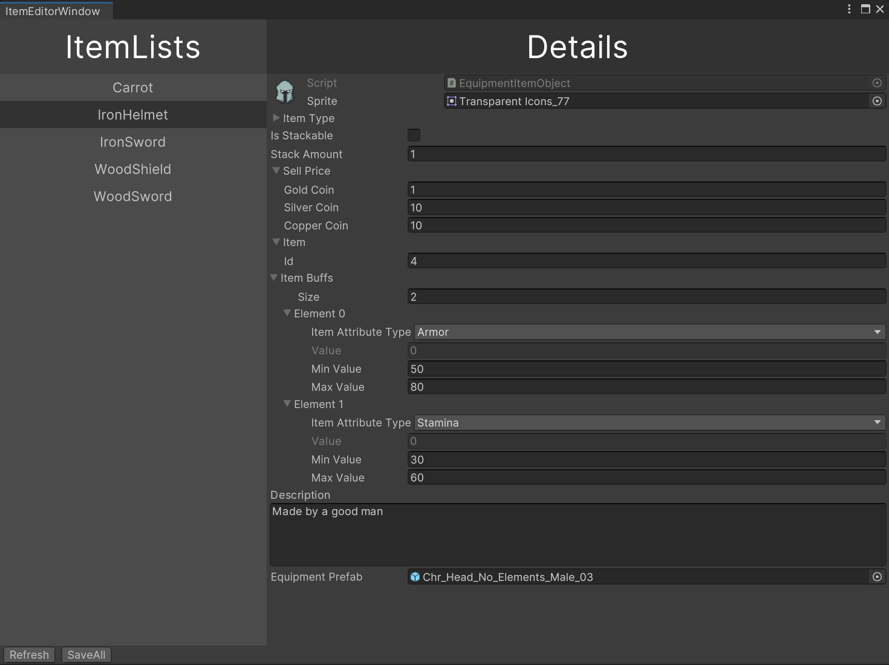
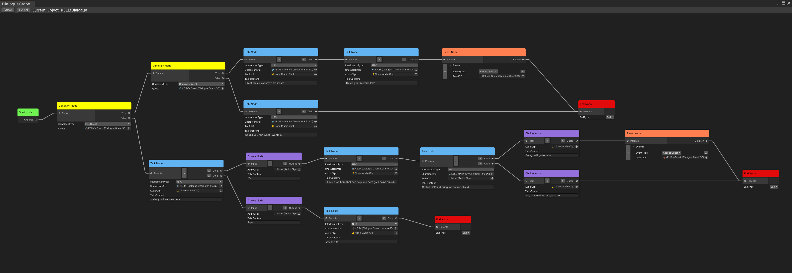

# DragonKnight

 一款美术资源全靠偷的RPG游戏

基本场景位于 Assets/PolygonFantasyKingdom/Scenes/Demo_ExteriorOnly_Optimized.unity

### 目前已完成的模块

- 背包
- 装备
- 对话
- 任务

### 目前没有完善的模块

- 交易
- NPC AI

### 打算提上日程的模块

- 技能
- 战斗
- 使对话以及物品支持Excel表对其进行加载？

### 目前在忙什么

自定义键位的触发功能以及游戏开始界面的之u走

~~-优化各个UI间的逻辑，正在构建设置面板，以提供更多的功能~~

~~打算学习并使用Addressable来对场景资源，素材资源进行打包，以达到优化内存以及启动速度的目的~~

### 其他

- UI动画采用`DoTween`制作

- 实现了物品编辑器的界面，与记录物品数据的`ScriptableObject`数据互通

  

- 实现了基于`DialogueGraph`的对话编辑器，同时联动了任务模块与背包模块，能够进行任务的接受，推进以及提交

  

> 最后更新于2021-7-26

